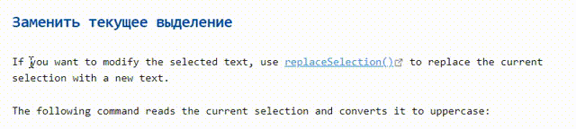

# Better MarkDown Link Inserter

Основано на плагине от salmund: [better link inserter](https://github.com/salmund/obsidian-better-link-inserter)

## До

## Плагин salmund'а

## Мой плагин

## Explanation

- It basically replace the former "insert markdown link", so you can just use my plugin instead

because if you try to insert a link when no word is selected it works the same way
